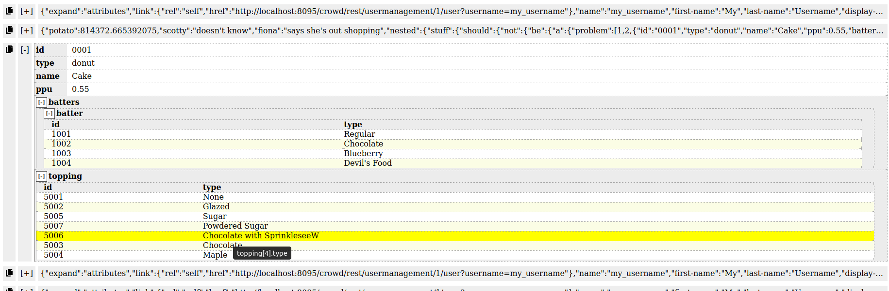

# An over-engineered JSON-oriented log tailer

It tails a file, and displays every line, 
while parsing valid JSON lines and displaying them as a table.

It's possible to use JSONPath expressions to filter the logs too.

The backend is written in Go, front-end is a React app that's 
bundled in the produced binary. 

JSON-tail is a single executable that opens a browser window 
when tailing a file.

Typical usage:

  json-tail -file ./my/json.log -port 8080 -usePolling true
  
"port" and "usePolling" settings are optional, defaulting to the values above.